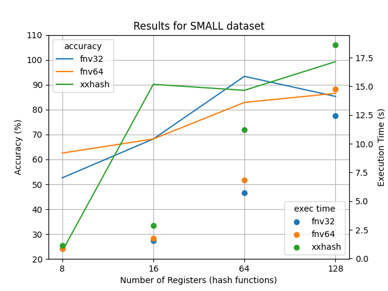
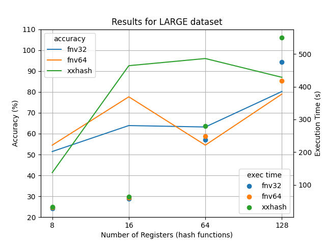

# Unique IP Counting Project

---

## Solution overview:
To solve the problem of counting the number of unique IPv4 address in a large (~120GB) file, 
two approaches were used:

1. **Flajolet Martin Algorithm**: a probabilistic approach used to count number of unique elements in a stream _on the fly_ and with _minimal memory consumption_
2. **Bitstore**: an approach based on exploiting the known maximum number of unique IPv4 addresses by efficiently representing each IP address as one index of the bitstore and counting set digits.

## Results overview:

1. The Implementation of the Flajolet Martin (FM) Algorithm identified the number of unique IPv4 addresses with 90.57% accuracy (estimation = 905,721,239, actual = 1,000,000,000) in 30 min 57 sec. The _main.go_ file of the implementation can be found in _cmd/flajolet_martin_ along with the execution logs.

2. <u>The Bitstore solution offered much better time performance (8 min 33 sec) and exact unique address count (= 1 billion) compared to the Flajolet Martin Algorithm.</u>  The _main.go_ file of the implementation can be found in _cmd/bitstore_ along with the execution logs.

---

# Solution Details
The section will provide details about the two proposed solutions.

Both solutions were tested on 3 generated files with a known number of unique IP addresses. The datasets are as follows:
- small.txt : 10,000,000 entries with 2,000,000 unique addresses
- medium.txt : 100,000,000 entries with 20,000,000 unique addresses
- large.txt : 300,000,000 entries with 60,000,000 unique addresses

The file generation algorithm can be found in the _pkg/ip_generator_ directory. The main file is located in _cmd/ip_generator_

---
## Bitstore
Originally, the Flajolet Martin Algorithm was chosen to be the solution for the problem. 
However, after the implementation, the execution speed turned out to be much slower than
theoretically anticipated. Due to the time limitation, I chose to implement this alternative solution 
which became apparent after learning more about byte and bit value representations in the process of the FM algorithm implementation.

---

### Solution explanation
The set of all possible IPv4 values is a finite set of size $2^{32}$. This is the case because IPv4 addresses are represented
by 32 bits or 4 bytes (each byte = 8 bits). Because of this, a collection of $2^{32}$ would be sufficient to index
every ip address, with each digit implicitly representing a unique ip address.

Additional implementation details can be found as inline comments in _pkg_bitset/bitset.go_

---

### Results for test data
The algorithm completed within 1 minute for all the test datasets.
The results for the test data can be found along with the final results in  _cmd/bitstore_

---

### Complexity
Two factors contribute to the space complexity of the solution: the reading buffer (= 256KB) 
and the slice of bytes representing the bitstore ($2^{29}$) bytes=512 MB because 1MB=1,048,576 bytes).

With regards to the computational complexity, the biggest contributors are file reading and IP parsing as shown 
in the CPU profile generated by pprof library below.

---

## Flajolet Martin Algorithm

This section will provide the intuition behind the algorithm, information regarding expected performance and results of algorithm implementation 
on smaller testing. Finally a brief discussion of the limitations and areas of improvements of the current implementation will be provided.

---

### Intuition behind the algorithm

The Flajolet-Martin algorithm is a probabilistic algorithm used to estimate the number of distinct elements in a large data stream, using limited memory [1]. 
It's particularly useful in data stream processing when the data set is too large to store in memory.

The algorithm relies on hashing each element in the stream to a uniform random value and observing the number of trailing zeros
in the binary representation of the hashed value. The intuition is that it’s unlikely to observe a long pattern of zeros unless you’ve seen many different numbers.
Based on probability distribution, the final estimate of distinct elements is then $2^k$, where k is the largest number of trailing zeroes encountered.

This relies on multiple assumptions regarding the distributions of the hash values, their distinction, hash space, and the distinctiveness of data itself.

The mathematical explanation of this algorithm is beyond the scope of the project but such information can be found in the
paper provided by the authors [2].

---

### Expected accuracy

The accuracy of the algorithm highly depends on the hash function used, and the randomness of the hash value distribution.
The authors of the original algorithm provide the estimations of error % based on the number of hash functions used as shown below:

---

### Summary of Implementation
The main steps of the algorithm implementation are as follows:

1. Select H hash functions (in this case, a hash function with a seed value dependent on the hash function ID). For each hash function: 
   2. Initialize an integer value maxZeroes to keep track of maximum number of trailing zeroes observed.
   2. Open the file containing the IP addresses and start a scanner with a buffer.
   3. Read one element from the stream at a time as byte slice (to improve reading speed).
   4. For each element, apply the hash function and count the number of trailing zeroes in the binary representation of the value returned by hashing
   5. Compare the number of the counted trailing zeroes and the value of maxZeroes and update if needed.
6.  Calculate the estimated value of unique elements by averaging the results between hash functions and applying correction term.

The full implementation can be found in the _pkg/flajolet_martin/flajolet_martin.go_ file. 

---

### Parameter tuning with test data

To select the best parameters for the final solution, the effects of the following parameters was examined:
1. Size of dataset: small.txt, medium.txt, large.txt
2. Hash function: fnv32, fnv64, xxhash
3. Number of hash functions: 8, 16, 64, 128

Based on the results, it can be observed that the xxhash function, on average, has the highest accuracies when compared to other functions used
across all file sizes. It also appears to be least sensitive to the number of hash functions used. Since the accuracy
was comparable for the 16 hash and 128 hash condition while offering a 5 times faster execution, the xxhash function with 16
random seeds was selected for the final test.

The complete results for the three test datasets can be found in the _data_ directory (e.g. large_test_result.csv)

  
  
  
  

---

### Complexity
Two factors contribute to the space complexity of the solution: the reading buffer (= 256KB) * number of hashes, 
the integer values of maximum number of trailing zeros (for each hash function), and the processed values themselves.

With regards to the computational complexity, the biggest contributors are file reading, casting of the byte slice representations
of the IP address to uint64 values, and the hashing function as shown in the CPU profile generated by pprof library below.
Additional system overhead that I am not currently able to interpret can be observed too.

---

### Analysis of effects of configuration parameters on restul accuracy and associated shortcomings of this implementation.

#### Number of hashes (registers):
Theoretically, more hashes lead higher accuracy since they can help with decreasing the variance of the results.
Due to limited computational resources, the number of hash functions that could be used to maintain reasonable execution time
had to be capped.

_Area of improvement_: Further investigating available hash functions as well as further research on data type handling could 
offer improvement with regards to the hashing performance.

#### Hash function selection:
Hash function characteristics such as uniformity of output distribition, randomness, and collision resistance
are all important for accuracy of the results. 

_Area of improvement_: the hash functions selected are either 32bit (fnv32) or 64bit (fnv64, xxhash). 
Given that the IP addresses are read as a slice containing 11 bytes (11*8=88 bits), it is possible that the loss of data
during the conversion to 32bit or 64bit hash lead to hash collisions negatively affecting the accuracy of the results.
To address this potential shortcoming, the performance of the algorithm was assessed with introduction of IP parsing to 32bit 
representations prior to hashing (parseIP parameter). Additionally, it is possible that other hash functions with higher performance 
can be selected.

#### Number of processed elements:
In its core, the algorithm is based on the probability of observing rare events, specifically hash values with 
large number of training zeros. In smaller datasets, the probability of observing such an event decreases, often leading to 
underestimation of discreet elements.

_Area of improvement_: The parameters of the algorithm were selected based on preliminary tests
on smaller datasets. Additionally, the test datasets were all randomly generated, resulting in different
value distribution between the test datasets and final data set. Combined with the randomness of the hash functions, 
and other shortcomings described above, it is possible that the assumption of normal distribution of the hash values was violated
, having a negative effect on the results.

#### Averaging of results from different hash functions
To calculate the estimated number of unique values, the results from all hash functions need to be combined.
There are different approaches to averaging these values:
1. Traditional mean calculation: sum of estimates from all hash functions divided by total number of hash functions used.
2. Harmonic mean calculation: number of hash functions divided by the reciprocals of the estimated counts.
3. Custom mean calculation: find the mean number of the trailing zeroes between the hash functions and calculate the estimate count of unique elements based on that.

_Area of improvement_: The traditional and harmonic mean calculations resulted in extremely inaccurate values, potentially
due to the high variance caused by small number of hash functions. The implementation of the averaging algorithms
as well as other averaging options could be further examined.

---

#### References:
[1] Leskovec, J., Rajaraman, A., & Ullman, J. D. (2020). Counting Distinct Elements in a Stream. In Mining of massive data sets (pp. 155–157). Cambridge University Press.

[2] Flajolet, P., & Martin, G. N. (1985). Probabilistic counting algorithms for data base applications. Journal of computer and system sciences, 31(2), 182-209.

